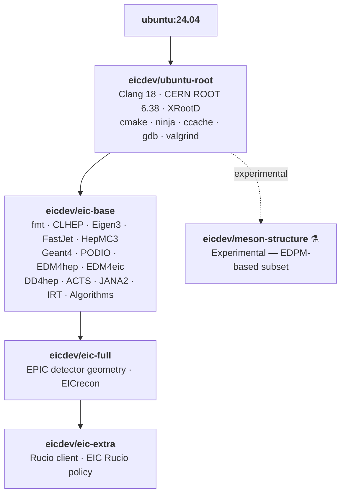

# EIC Dev Containers

> **(!) NOT OFFICIAL AND NOT RECOMMENDED** unless you know what you are doing.
>
> **What** — Unofficial EIC containers built from clean source with debug symbols enabled.  
> **Compatibility with EIC** — Partial. Package versions track the official EIC spack environment but are not guaranteed to stay in sync.  
> **What this is NOT** — A full-featured rewrite of `eic-shell` / `eicweb/eic_xl`. A large portion of the EIC software ecosystem is not installed.  
> **Why** — To use EIC libraries in IDEs and other tooling without spack complexity. Clone a repo, run cmake, install — modify any step freely. No spack, no environment modules, no magic.

---

## Image inheritance



| Image | Based on | Adds |
|---|---|---|
| `eicdev/ubuntu-root` | `ubuntu:24.04` | Clang 18, CERN ROOT 6.38, XRootD, build tools, debug tooling |
| `eicdev/eic-base` | `ubuntu-root` | Full EIC dependency stack (see [package list](#package-versions)) |
| `eicdev/eic-full` | `eic-base` | EPIC detector geometry, EICrecon reconstruction framework |
| `eicdev/eic-extra` | `eic-full` | Rucio client + EIC storage policy for data access at JLab |
| `eicdev/meson-structure` | `ubuntu-root` | Experimental EDPM-based build (not part of main chain) |

---

## How to use

### Pull and run interactively

```bash
# Minimal: ROOT + build tools only
docker pull eicdev/ubuntu-root:latest
docker run --rm -it eicdev/ubuntu-root:latest

# Full EIC dependency stack (no detector geometry)
docker pull eicdev/eic-base:latest
docker run --rm -it eicdev/eic-base:latest

# With EPIC geometry and EICrecon
docker pull eicdev/eic-full:latest
docker run --rm -it eicdev/eic-full:latest

# With Rucio data access (JLab storage)
docker pull eicdev/eic-extra:latest
docker run --rm -it eicdev/eic-extra:latest
```

### Mount your source tree

```bash
# Mount local code at /work inside the container
docker run --rm -it \
  -v /path/to/your/repo:/work \
  eicdev/eic-base:latest

# Inside the container — standard CMake workflow:
cd /work
cmake -B build -S . -DCMAKE_BUILD_TYPE=RelWithDebInfo
cmake --build build -j$(nproc)
```

### IDE remote development

The images are designed for use with IDE remote/container plugins (VS Code Dev Containers, CLion remote, etc.). All packages are installed under `/app/<package>` and added to `CMAKE_PREFIX_PATH`, so CMake finds them automatically.

**VS Code Dev Containers** — add a `.devcontainer/devcontainer.json` to your project:

```json
{
  "image": "eicdev/eic-base:latest",
  "mounts": ["source=${localWorkspaceFolder},target=/work,type=bind"],
  "workspaceFolder": "/work"
}
```

**CLion** — use *Settings → Build → Docker* and point to `eicdev/eic-base:latest` (or `eic-full` if you need EPIC/EICrecon).

### Environment variables inside containers

All environment variables are set in the image. After entering a shell, `ROOT`, `DD4hep`, `ACTS`, `JANA2`, etc. are all ready:

```bash
root --version            # CERN ROOT
ddsim --help              # DD4hep simulation
jana -l                   # JANA2 plugin list
eicrecon --help           # EICrecon (eic-full and above only)
```

### Rucio data access (eic-extra)

The `eic-extra` image includes a pre-configured Rucio client pointed at `rucio-server.jlab.org` with a read-only public account (`eicread`). No extra setup is needed for read access:

```bash
rucio list-dids eic:*
rucio download eic:<dataset>
```

---

## Package versions

### eic-base

| Package | Version | Notes |
|---|---|---|
| CERN ROOT | 6.38.00 | Built from source, debug symbols on |
| fmt | 11.2.0 | Built from source — Ubuntu ships 10.1.1, PODIO requires 11+ |
| CLHEP | 2.4.7.1 | |
| Eigen3 | 3.4.0 | |
| Catch2 | 3.8.1 | |
| FastJet | 3.5.0 + contrib 1.102 | |
| HepMC3 | 3.3.0 | |
| Geant4 | 11.3.2 | |
| PODIO | v01-06 | |
| VGM | 5.3.1 | |
| EDM4HEP | v00-99-04 | |
| EDM4EIC | v8.8.0 | |
| DD4hep | v01-36 | |
| ActsSVG | v0.4.56 | |
| OnnxRuntime | 1.17.0 | Prebuilt CPU-only binary |
| ACTS | v44.4.0 | |
| JANA2 | v2.4.3 | |
| IRT | v1.0.10 | |
| Algorithms | v1.2.0 | |
| spdlog | v1.17.0 | Built from source for fmt 11 ABI compatibility |

### eic-full

| Package | Version |
|---|---|
| EPIC | main |
| EICrecon | main |

> **Why some packages are built from source instead of apt:**
> - `fmt`: Ubuntu 24.04 ships v10.1.1; PODIO requires `fmt::println(FILE*,...)` from v11.
> - `spdlog`: Ubuntu's package is compiled against fmt 10, ABI-incompatible with fmt 11.
> - `nlohmann/json`: Built separately (v3.11.3) so all packages share the same ABI namespace; the system copy conflicts with ACTS's bundled copy.
> - `ROOT`: Needs debug symbols and specific feature flags (`-Droot7`, `-Dgdml`, `-Dxrootd`).

---

## How to build

### Prerequisites

- Docker with BuildKit support (Docker 23+)
- 30+ GB disk space per full build
- Adequate RAM (16 GB minimum, 32 GB recommended for parallel builds)

### Option 1 — build_images.py (recommended)

Builds the chain sequentially, streams live output, and prints a summary table.

```bash
# Build all images (auto-detects CPU count)
python3 build_images.py

# Build with 24 threads, push to registry
python3 build_images.py --no-cache --push -j 24

# Build only eic-base and its dependencies
python3 build_images.py ubuntu-root eic-base

# Custom tag (also tag as :latest)
python3 build_images.py --tag v1.0 --latest --push

# Dry run — print commands without executing
python3 build_images.py --dry-run
```

### Option 2 — docker buildx bake

Uses `docker-bake.hcl`. The `contexts` blocks wire `FROM` dependencies at the BuildKit level. Requires the `docker-container` driver (one-time setup):

```bash
docker buildx create --name eic-builder --driver docker-container --use
```

```bash
# Build + push all images
docker buildx bake -f docker-bake.hcl --push

# Build one target (its dependencies build first automatically)
docker buildx bake -f docker-bake.hcl --push eic-base

# No-cache rebuild
docker buildx bake -f docker-bake.hcl --no-cache --push

# Dry run — print resolved config as JSON, build nothing
docker buildx bake -f docker-bake.hcl --print

# Custom threads + tag
BUILD_THREADS=24 IMAGE_TAG=v1.0 docker buildx bake -f docker-bake.hcl --push
```

> The `docker-container` driver does not support `--load`. Use `--push` to push to a registry, or use `build_images.py` for local builds.

### Option 3 — manual docker buildx build

```bash
docker buildx build --tag eicdev/ubuntu-root:latest --build-arg BUILD_THREADS=24 ubuntu-root/
docker buildx build --tag eicdev/eic-base:latest    --build-arg BUILD_THREADS=24 eic-base/
docker buildx build --tag eicdev/eic-full:latest    --build-arg BUILD_THREADS=24 eic-full/
docker buildx build --tag eicdev/eic-extra:latest   --build-arg BUILD_THREADS=24 eic-extra/
```

### Build arguments

| Argument | Default | Description |
|---|---|---|
| `BUILD_THREADS` | `8` | Parallel make/cmake jobs (`-j`) |
| `CXX_STANDARD` | `20` | C++ standard for all packages |
| `IMAGE_TAG` | `latest` | Image tag (bake only) |

Individual package versions can be overridden with `VERSION_*` build args (e.g. `VERSION_ACTS`, `VERSION_GEANT4`). Defaults match the official EIC spack environment.

### PowerShell

```powershell
$env:BUILD_THREADS = "24"
python3 build_images.py --push

# Or with bake
$env:BUILD_THREADS = "24"; $env:IMAGE_TAG = "v1.0"
docker buildx bake -f docker-bake.hcl --push

# Clean up
Remove-Item Env:\BUILD_THREADS, Env:\IMAGE_TAG
```

### Debugging a failed build step

```bash
# Drop into a bash shell at the failing layer (Linux/macOS)
BUILDX_EXPERIMENTAL=1 docker buildx debug --invoke bash build \
  --progress=plain -f eic-base/Dockerfile eic-base/

# PowerShell
$env:BUILDX_EXPERIMENTAL = "1"
docker buildx debug --invoke bash build --progress=plain -f eic-base/Dockerfile eic-base/
```

---

## Repository layout

```
eicdev-containers/
├── build_images.py        Python build script (recommended entry point)
├── docker-bake.hcl        BuildKit HCL config for docker buildx bake
├── ubuntu-root/
│   ├── Dockerfile         Layer 1: Ubuntu 24.04 + Clang 18 + CERN ROOT
│   └── bashrc             Shell configuration
├── eic-base/
│   ├── Dockerfile         Layer 2: Full EIC dependency stack
│   └── rucio.cfg          Rucio client config (read-only JLab account)
├── eic-full/
│   └── Dockerfile         Layer 3: EPIC geometry + EICrecon
├── eic-extra/
│   ├── Dockerfile         Layer 4: Rucio client + EIC storage policy
│   └── rucio.cfg
└── meson-structure/
    └── Dockerfile         Experimental: EDPM-based subset (not part of main chain)
```
